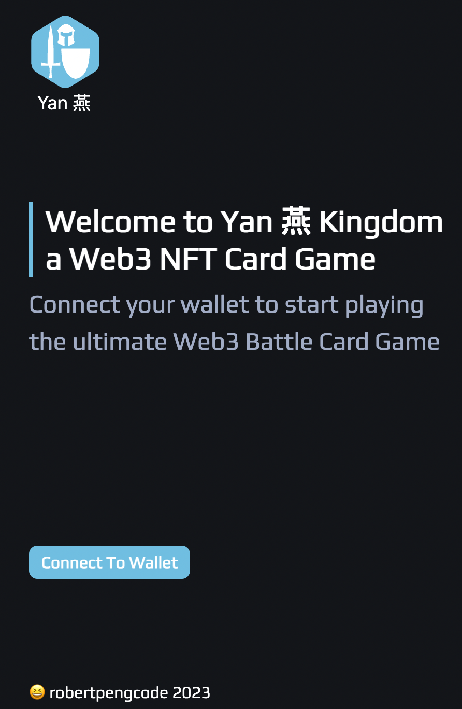
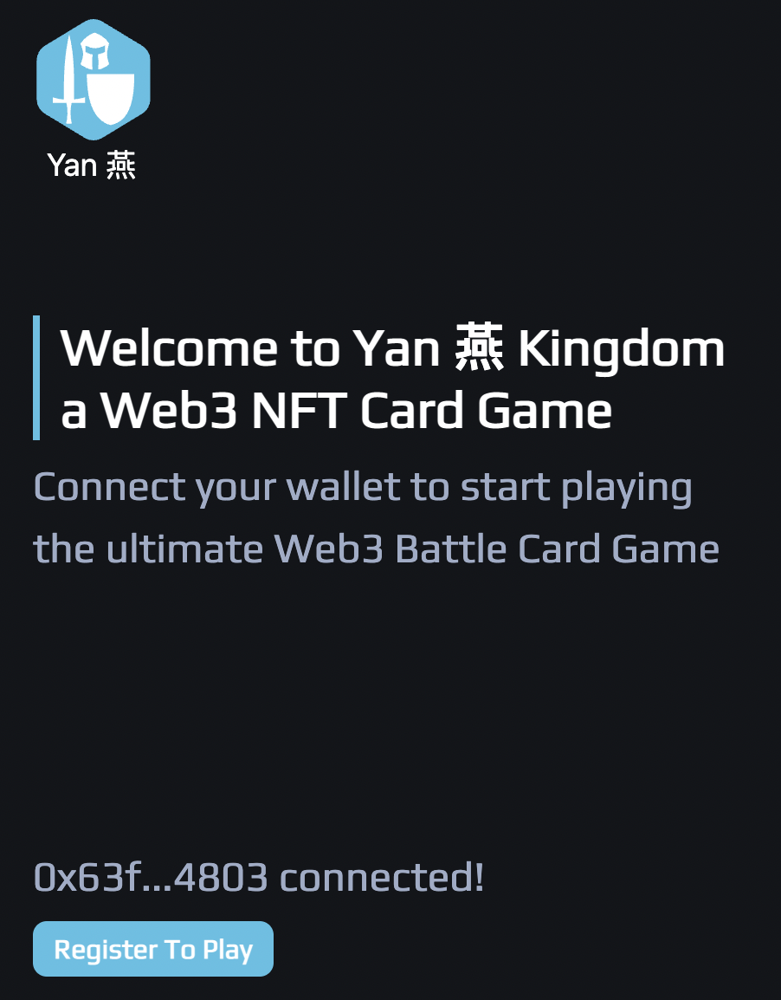
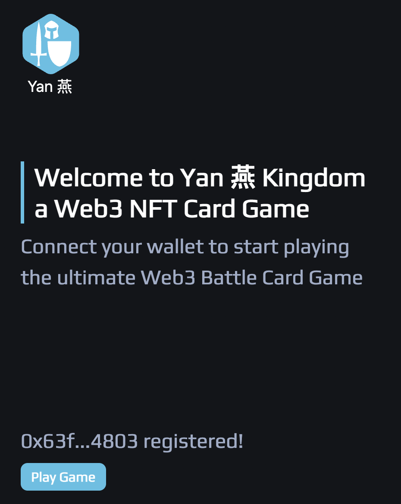
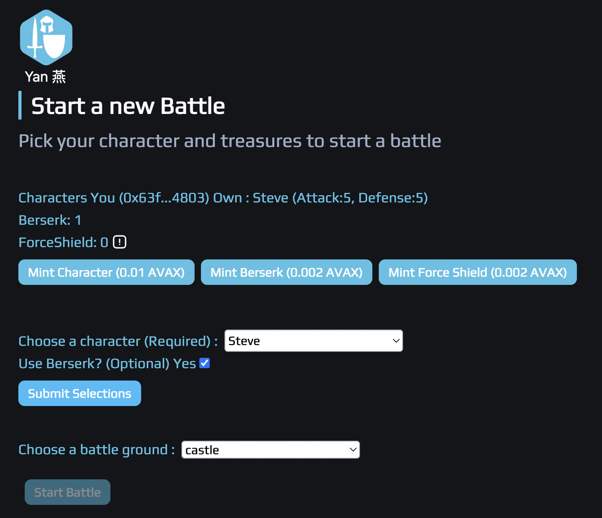
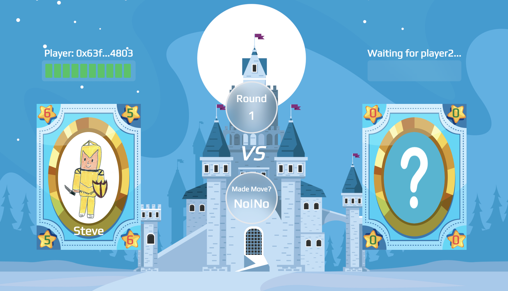
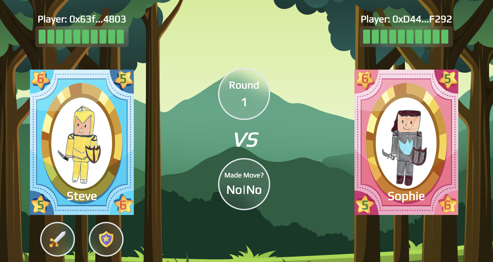
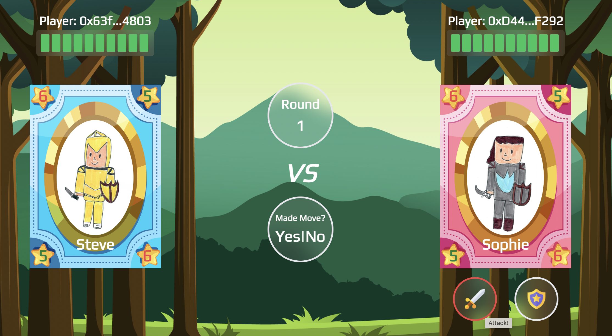
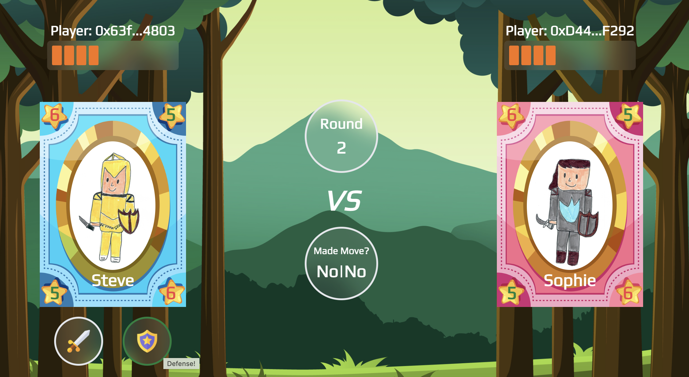
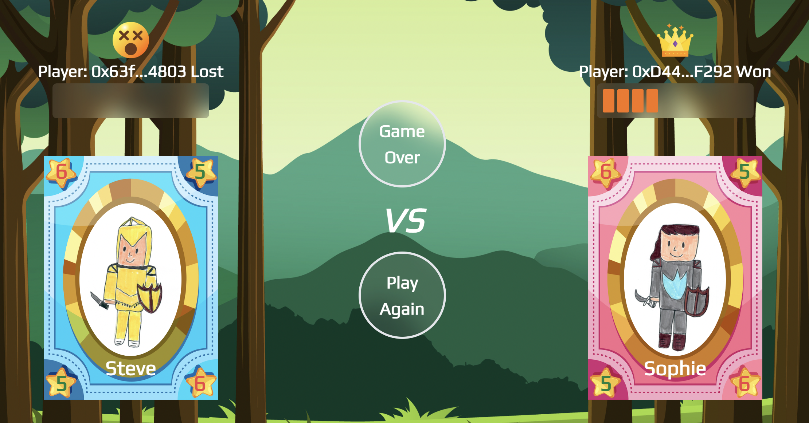

## React Frontend

Connect:

Register Player:

Play Game:

Mint Game Character and Treasures:

Player1 is waiting for Player2:

Player2 joined the battle:

Player2 attacks:

Player1 defenses:

Game Over - Player2 won:

